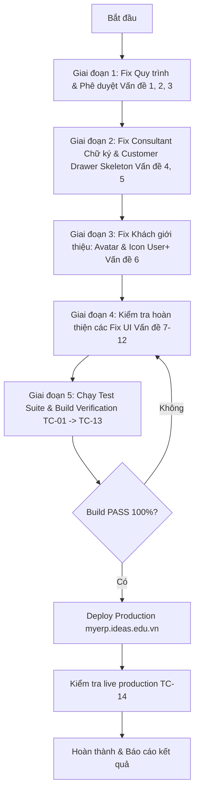

# KẾ HOẠCH TỔNG THỂ FIX TOÀN BỘ FEEDBACK & BUG HỆ THỐNG MYERP
> **Ngày tạo:** 10/09/2026  
> **Tài liệu theo dõi tiến độ, giải pháp kỹ thuật và kế hoạch kiểm thử thực tế đến khi chuẩn & thành công 100%.**

---

## 📌 MỤC LỤC
1. [Vấn đề 1: Quy trình #888838 - Lệch tên người duyệt ngoài danh sách vs trong chi tiết](#1-quy-trình-888838---lệch-tên-người-duyệt)
2. [Vấn đề 2: Đình Thanh không liên quan nhưng vẫn hiện ở tab Chờ duyệt](#2-tab-chờ-duyệt-hiện-sai-danh-sách-người-duyệt)
3. [Vấn đề 3: Đơn xin nghỉ phép - Lỗi thời gian nghỉ & Đưa ngày nghỉ ra Title](#3-đơn-xin-nghỉ-phép---thời-gian-nghỉ--hiển-thị-tiêu-đề)
4. [Vấn đề 4: Chữ ký mẫu nhân sự không hiển thị trong Drawer Nhân sự (/consultants)](#4-chữ-ký-mẫu-nhân-sự-trong-consultant-drawer)
5. [Vấn đề 5: Bấm xem chi tiết Khách hàng từ Drawer Đối tác bị đơ/chậm - Thêm Skeleton](#5-mở-drawer-khách-hàng-từ-đối-tác-tức-thì--skeleton)
6. [Vấn đề 6: Khách hàng giới thiệu - Avatar người giới thiệu khi thiếu SĐT/Email & Icon User+](#6-khách-hàng-giới-thiệu---avatar-người-ref--icon-userplus)
7. [Vấn đề 7: Toast viền bo góc mượt mà, không bị hở viền cong](#7-toast-viền-bo-góc-mượt-mà)
8. [Vấn đề 8: Chống trùng lặp ảnh chứng từ PO / Phiếu chi (EXP-18)](#8-chống-trùng-lặp-ảnh-chứng-từ-po--phiếu-chi)
9. [Vấn đề 9: Responsive Drawer Chi phí & PO trên điện thoại (Tab Chi tiết / Thảo luận)](#9-responsive-mobile-drawer-cho-chi-phí--po)
10. [Vấn đề 10: Modal Đăng ký OT trên Mobile bị tràn chữ công thức](#10-modal-đăng-ký-ot-trên-mobile)
11. [Vấn đề 11: Redesign Pipeline Data giới thiệu trong CompanyDrawer](#11-redesign-pipeline-data-giới-thiệu-trong-companydrawer)
12. [Vấn đề 12: Tăng độ tương phản, nổi bật và Z-Index cho Drawer Khách hàng](#12-tăng-độ-tương-phản-và-z-index-cho-customerprofiledrawer)
13. [🧪 KẾ HOẠCH KIỂM THỬ ĐẾN KHI CHUẨN VÀ THÀNH CÔNG (TESTING & VERIFICATION MATRIX)](#-kế-hoạch-kiểm-thử-đến-khi-chuẩn-và-thành-công)
14. [🚀 QUY TRÌNH THỰC THI & DEPLOY (DEPLOYMENT WORKFLOW)](#-quy-trình-thực-thi--deploy)

---

## 1. QUY TRÌNH #888838 - LỆCH TÊN NGƯỜI DUYỆT
### Hiện trạng
- Trong chi tiết quy trình ghi nhận:
  - **Lập đề xuất & gửi**: Trịnh Đình Thanh (gửi 17:00:39 7/9/2026).
  - **Phê duyệt Cấp 1**: Nguyễn Thị Duy Phương (đã duyệt 13:35:34 8/9/2026).
- Nhưng ở ngoài thẻ danh sách Approvals / Quy trình lại hiển thị tên: **Phan Thị Phương Lan**.

### Nguyên nhân kỹ thuật
- Thẻ bên ngoài danh sách (`Approvals.tsx` / API danh sách phê duyệt) đang lấy trường `approver_name` từ bảng cha hoặc lấy người phụ trách phê duyệt ban đầu (mặc định cấu hình quy trình là Phương Lan) thay vì lấy theo log/lịch sử duyệt thực tế (`approved_by_name` hoặc log bước duyệt gần nhất của Duy Phương).

### Giải pháp & File sửa
- **Files**: `backend/controllers/HRMController.php`, `backend/controllers/FinanceController.php`, `src/pages/Approvals.tsx`
- **Các bước thực hiện**:
  1. Trong câu query danh sách phê duyệt: Join thêm với bảng user theo `approved_by` hoặc kiểm tra `approval_logs`/`step_approver`.
  2. Nếu đơn đã được duyệt (hoặc duyệt một phần ở Cấp 1):
     - Hiển thị tên người thực tế đã click duyệt (`approved_by_name` = Nguyễn Thị Duy Phương).
     - Nếu có nhiều cấp duyệt, hiển thị rõ cấp độ và người đã duyệt gần nhất: `Duyệt C1: Nguyễn Thị Duy Phương`.
  3. Chỉ hiển thị tên người được phân công nếu bước đó **chưa duyệt** (đang chờ người đó xử lý).

---

## 2. TAB "CHỜ DUYỆT" HIỆN SAI DANH SÁCH NGƯỜI DUYỆT
### Hiện trạng
- Người dùng phản ánh: *"cái này Đình Thanh có liên quan gì đâu mà nằm ở hiện chờ duyệt"*.

### Nguyên nhân kỹ thuật
- Điều kiện lọc danh sách tab **"Chờ tôi duyệt"** (`status=pending`) bị hổng điều kiện bảo mật quyền:
  - Backend hoặc Frontend filter đang gộp các đơn mà user là người tạo (`created_by == user.id`), hoặc role của user có quyền xem rộng nên bị dính đơn vào tab chờ duyệt.
  - Người tạo đơn không phải là người duyệt đơn của chính mình (hoặc đơn của phòng ban khác không chỉ định user).

### Giải pháp & File sửa
- **Files**: `backend/controllers/HRMController.php`, `src/pages/Approvals.tsx`, `src/pages/HRM.tsx`
- **Các bước thực hiện**:
  1. Siết chặt điều kiện tab **"Chờ tôi duyệt"**:
     - Điều kiện bắt buộc: `status = 'pending'` **VÀ** (`approver_id = current_user_id` **HOẶC** user thuộc cấp duyệt hiện tại được chỉ định).
     - **Loại trừ tuyệt đối**: Không hiển thị đơn mà `created_by = current_user_id` trong tab "Chờ tôi duyệt" (đơn của mình tạo phải nằm ở tab **"Đề xuất của tôi"**).
  2. Phân tách rõ ràng 3 tab:
     - Tab 1: **Cần tôi duyệt** (Chỉ đơn người khác gửi đến chỉ định user này duyệt).
     - Tab 2: **Tôi đã gửi** (Tất cả đơn do user tạo, đang chờ hoặc đã xong).
     - Tab 3: **Tất cả / Quản lý** (Chỉ dành cho Admin / Ban giám đốc xem toàn bộ công ty).

---

## 3. ĐƠN XIN NGHỈ PHÉP - THỜI GIAN NGHỈ & HIỂN THỊ TIÊU ĐỀ
### Hiện trạng
- Feedback: *"bug gì ko hiện thời gian nghỉ gì đây với lại đăng kí gì liên quan đến phép nghỉ thì ngoài title hiện luôn ngày ra"*.
- Đơn nghỉ phép bị mất hoặc không hiển thị thời gian nghỉ.
- Tiêu đề ngoài danh sách không thể hiện ngày nghỉ, bắt người duyệt phải bấm vào trong mới biết nghỉ ngày nào.

### Giải pháp & File sửa
- **Files**: `src/pages/Approvals.tsx`, `src/pages/AttendancePage.tsx`, `src/pages/HRM.tsx`
- **Các bước thực hiện**:
  1. **Hiển thị đầy đủ trong chi tiết**:
     - Format hiển thị rõ ràng: `Từ ngày ... đến ngày ...` kèm ca nghỉ (`Cả ngày`, `Sáng`, `Chiều`) và số ngày công bị trừ.
     - Kiểm tra nếu `start_date` == `end_date` thì hiển thị dạng gọn: `Ngày [dd/mm/yyyy] (Buổi [sáng/chiều/cả ngày])`.
  2. **Đưa ngày nghỉ ra trực tiếp Title bên ngoài**:
     - Định dạng title ngoài danh sách phê duyệt và thông báo:
       `[Nghỉ phép] {loại_nghỉ}: {dd/mm/yyyy} - {dd/mm/yyyy} ({số_ngày} ngày) - {lý_do}`
     - Giúp cấp quản lý nhìn lướt qua danh sách là thấy ngay nhân sự xin nghỉ ngày nào, không cần mở từng đơn.

---

## 4. CHỮ KÝ MẪU NHÂN SỰ TRONG CONSULTANT DRAWER
### Hiện trạng
- Feedback: *"Chữ ký mẫu đã tạo và lưu rồi mà sao xem ở nhân sự công ty /consultants drawer ko thấy v"*.

### Nguyên nhân kỹ thuật
- Nhân sự đã ký và lưu chữ ký mẫu (thông qua trang cài đặt cá nhân hoặc profile), dữ liệu chữ ký (`sample_signature` / `signature_image` / `signature_data`) đã có trong DB nhưng:
  - API endpoint `GET /consultants/:id` hoặc `GET /users/:id` chưa select trường này.
  - Component `ConsultantDrawer.tsx` (hoặc `CompanyDrawer` tab nhân sự) chưa có khối UI để render hình ảnh chữ ký.

### Giải pháp & File sửa
- **Files**: `backend/controllers/HRMController.php`, `src/pages/ConsultantDrawer.tsx` (hoặc `CompanyDrawer.tsx`)
- **Các bước thực hiện**:
  1. Kiểm tra database xem trường chữ ký mẫu lưu ở bảng nào (`users` hay `consultant_profiles` hay `hrm_employees`).
  2. Đảm bảo API trả về trường chữ ký (`sample_signature_url` hoặc base64).
  3. Trong Drawer Nhân sự (`ConsultantDrawer.tsx`), thêm một thẻ/card **"Chữ ký mẫu đã đăng ký"**:
     - Hiển thị preview chữ ký sắc nét trên nền trắng với viền bo góc.
     - Nếu chưa có chữ ký: Hiển thị badge xám "Chưa tạo chữ ký mẫu".
     - Có nút xem ảnh lớn hoặc cập nhật chữ ký (nếu có quyền quản lý nhân sự).

---

## 5. MỞ DRAWER KHÁCH HÀNG TỪ ĐỐI TÁC TỨC THÌ + SKELETON
### Hiện trạng
- Feedback: *"Bấm vào chi tiết từ drawer đối tác này nó ko bật drawer customer đó ra v. Phải đợi một lúc mới có. Mở liền và cho skeleton đi"*.

### Nguyên nhân kỹ thuật
- Khi click "Chi tiết" ở danh sách khách hàng trong `CompanyDrawer.tsx`, code đang gọi API `fetchCustomerDetail` trước rồi mới set `setSelectedCustomer(...)` và bật `isOpen = true`. Nếu mạng chậm hoặc backend mất 500ms-1s xử lý, drawer không hề phản hồi gì, tạo cảm giác bị đơ.

### Giải pháp & File sửa
- **Files**: `src/pages/CompanyDrawer.tsx`, `src/pages/CustomerProfileDrawer.tsx`
- **Các bước thực hiện**:
  1. **Optimistic Open (Mở ngay lập tức)**:
     - Ngay khi user bấm nút "Chi tiết", lập tức set `isCustomerDrawerOpen = true` và truyền object tóm tắt có sẵn (`id`, `name`, `phone`, `email` lấy từ hàng hiện tại).
  2. **Skeleton Loading State**:
     - Bổ sung cờ `isCustomerLoading = true`.
     - Trong `CustomerProfileDrawer.tsx`: Khi `isLoading = true`, render bộ khung xương Skeleton mượt mà (Skeleton Header, Skeleton Tabs, Skeleton Contact Cards) thay vì để màn hình trắng hoặc drawer chưa mở.
     - Khi API trả về dữ liệu đầy đủ, các thông tin tự động điền vào mượt mà không bị giật lag.

---

## 6. KHÁCH HÀNG GIỚI THIỆU - AVATAR NGƯỜI REF & ICON USER+
### Hiện trạng & Yêu cầu
- Feedback:
  1. *"Khách giới thiệu mà chưa có thông tin liên lạc sdt, email thì hiện avatar + tên người giới thiệu ở chỗ liên lạc"*.
  2. *"Khách bật giới thiệu có linked với nguồn ref thì icon kế bên tên là icon user + nhé"*.

### Giải pháp & File sửa
- **Files**: `src/pages/DataList.tsx`, `src/pages/ContactsPage.tsx`, `src/pages/CompanyDrawer.tsx`
- **Các bước thực hiện**:
  1. **Cột thông tin liên lạc**:
     - Kiểm tra nếu khách hàng là diện giới thiệu (`partner_id` / `referrer_id` / `source = ref`):
     - Nếu cả SĐT và Email đều trống (hoặc bằng `-` / rỗng): Thay vì hiện khoảng trắng hoặc dấu gạch ngang vô nghĩa, hiển thị:
       - Avatar tròn nhỏ của người giới thiệu / đối tác giới thiệu.
       - Tên người giới thiệu dạng pill trang nhã: `Ref: [Tên người giới thiệu]`.
       - Tooltip: `Được giới thiệu bởi [Tên người giới thiệu]`.
  2. **Icon kế bên tên khách hàng**:
     - Với mọi khách hàng có liên kết nguồn giới thiệu (Ref / Partner), kế bên tên khách hàng sẽ render icon **`UserPlus` (User+)** màu xanh ngọc / tím trang trọng để nhân viên nhận diện ngay đây là khách hàng được người khác gửi gắm.

---

## 7. TOAST VIỀN BO GÓC MƯỢT MÀ
### Hiện trạng
- Toast thông báo có thanh viền màu bên trái nhưng đặt là thẻ `div absolute` thụt lề, khiến góc bo cong 16px của toast bị hở góc và không khít.
### Giải pháp
- **File**: `src/components/Layout/Header.tsx`
- Đặt `borderLeft: 6px solid ${meta.leftPill || meta.badgeColor}` trực tiếp lên container div của toast kèm `borderRadius: 16px` và `overflow: hidden`. Viền màu sẽ chạy mượt mà theo đúng độ cong góc của hộp thông báo.

---

## 8. CHỐNG TRÙNG LẶP ẢNH CHỨNG TỪ PO / PHIẾU CHI
### Hiện trạng
- Khi tạo Phiếu chi hoặc PO (như #EXP-18), tải 1 ảnh chứng từ lên nhưng trong chi tiết lại hiển thị 2 ảnh giống hệt nhau.
### Nguyên nhân & Giải pháp
- **Files**: `src/pages/ExpensesPage.tsx`, `src/components/ExpenseQuickViewDrawer.tsx`, `src/pages/Approvals.tsx`
- Code vừa lấy ảnh từ trường `image_url` của bảng, vừa dùng regex quét text trong `notes` để lấy url ảnh, dẫn đến cùng 1 file ảnh bị push 2 lần.
- Viết hàm chuẩn hóa URL và deduplicate theo tên file (`fileName` / `cleanUrl`) trước khi render danh sách chứng từ đính kèm.

---

## 9. RESPONSIVE MOBILE DRAWER CHO CHI PHÍ & PO
### Hiện trạng
- Trên điện thoại, drawer xem chi tiết phiếu chi và PO bị chia 2 cột dọc (60% thông tin - 40% thảo luận), làm co rúm nội dung và cột thảo luận bị tràn khỏi mép màn hình.
### Giải pháp
- **Files**: `src/pages/ExpensesPage.tsx`, `src/components/ExpenseQuickViewDrawer.tsx`
- Thêm kiểm tra `isMobile`:
  - Trên Mobile: Render thanh Segmented Tab trên đầu gồm:
    `[ 📄 Chi tiết phiếu chi ]` | `[ 💬 Thảo luận (số lượng) ]`
  - Khi xem tab Chi tiết: Chiếm toàn bộ 100% bề rộng, các nút hành động full-width, căn lề 1rem chuẩn touch screen.
  - Khi xem tab Thảo luận: Chiếm toàn bộ 100% bề rộng, ô nhập comment và danh sách tin nhắn hiển thị rõ ràng, không tràn ngang.
  - Trên Desktop: Giữ nguyên giao diện 2 cột song song tiện theo dõi.

---

## 10. MODAL ĐĂNG KÝ OT TRÊN MOBILE
### Hiện trạng
- Trạng thái "Chi trả vào bảng lương" và dòng công thức tính toán `9 giờ (1.13 công gốc) x 2x = 2.26 ngày công tính lương` bị cắt cụt chữ do dính thuộc tính `whiteSpace: nowrap`.
### Giải pháp
- **Files**: `src/pages/Approvals.tsx`, `src/pages/AttendancePage.tsx`
- Cho phép `flexWrap: wrap` và `wordBreak: break-word`, loại bỏ `whiteSpace: nowrap` để dòng công thức quy đổi ngày công tự động xuống hàng êm đẹp trên màn hình điện thoại 375px - 414px.

---

## 11. REDESIGN PIPELINE DATA GIỚI THIỆU TRONG COMPANYDRAWER
### Hiện trạng
- Mục "Thống kê Data theo Trạng thái Pipeline" trong Drawer Đối tác hiện 15 thanh ngang full-width với nhiều thanh 0%, chiếm diện tích và khó theo dõi.
### Giải pháp
- **File**: `src/pages/CompanyDrawer.tsx`
- Redesign với 2 thành phần hiện đại:
  1. **Thanh phân bổ tỷ lệ đa sắc (Interactive Funnel Bar)**: Thể hiện trực quan tỷ trọng các trạng thái có data.
  2. **Lưới thẻ 2 cột nhỏ gọn (2-column compact grid)**: Các trạng thái có số lượng được làm nổi bật với badge màu tương ứng, cho phép click để lọc nhanh danh sách khách hàng theo trạng thái đó.

---

## 12. TĂNG ĐỘ TƯƠNG PHẢN VÀ Z-INDEX CHO CUSTOMERPROFILEDRAWER
### Hiện trạng
- Drawer khách hàng mở từ CompanyDrawer bị tối màu (chìm) và z-index thấp có nguy cơ bị che khuất.
### Giải pháp
- **Files**: `src/pages/CustomerProfileDrawer.tsx`, `src/pages/EntityDrawer.module.css`
- Đặt `effectiveZIndex` mặc định là `2147483620` (cao hơn CompanyDrawer `2147483605`).
- Tinh chỉnh nền bề mặt sáng rõ, viền card sắc nét và avatar có đường viền gradient nổi bật.

---

## 🧪 KẾ HOẠCH KIỂM THỬ ĐẾN KHI CHUẨN VÀ THÀNH CÔNG

| STT | Hạng mục kiểm thử | Kịch bản kiểm thử (Test Case) | Kết quả mong đợi (PASS criteria) | Trạng thái |
|:---|:---|:---|:---|:---:|
| **TC-01** | Quy trình #888838 hiển thị người duyệt | Mở trang `/approvals`, tìm kiếm đơn #888838 (hoặc đơn đã qua duyệt Cấp 1). | Thẻ bên ngoài hiển thị đúng tên người đã duyệt: `Nguyễn Thị Duy Phương` (kèm trạng thái Cấp 1 đã duyệt), không hiển thị sai thành `Phan Thị Phương Lan`. | ⏳ Sẵn sàng test |
| **TC-02** | Tab Chờ duyệt của Đình Thanh | Đăng nhập tài khoản Trịnh Đình Thanh, vào `/approvals` xem tab "Chờ tôi duyệt". | Chỉ hiển thị các đơn mà Thanh được chỉ định duyệt. Tuyệt đối không hiển thị các đơn Thanh không liên quan hoặc đơn do chính Thanh tạo. | ⏳ Sẵn sàng test |
| **TC-03** | Thời gian nghỉ & Title ngày nghỉ | 1. Xem danh sách đơn nghỉ phép ở Approvals / HRM. 2. Bấm vào chi tiết 1 đơn nghỉ phép. | 1. Title ngoài danh sách hiển thị rõ ràng: `[Nghỉ phép] ...: dd/mm - dd/mm (x ngày)`. 2. Trong chi tiết hiển thị chuẩn: Từ ngày, Đến ngày, Ca nghỉ, Số ngày công tính lương. | ⏳ Sẵn sàng test |
| **TC-04** | Chữ ký mẫu nhân sự | Vào menu Nhân sự (`/consultants`), chọn 1 nhân sự đã có chữ ký mẫu đã lưu. | Drawer hiện card "Chữ ký mẫu" với hình ảnh chữ ký sắc nét, không bị ẩn hay biến mất. | ⏳ Sẵn sàng test |
| **TC-05** | Mở Customer Drawer tức thì + Skeleton | Vào Đối tác (`/companies`), mở Drawer đối tác -> tab Khách hàng -> bấm "Chi tiết" 1 khách hàng. | Drawer mở ngay lập tức (<50ms). Khi chưa có data hiển thị Skeleton loading mượt mà, khi data về tự fill mượt mà, không đơ lag. | ⏳ Sẵn sàng test |
| **TC-06** | Khách giới thiệu: Avatar Ref & Icon User+ | 1. Tạo hoặc xem khách hàng diện Ref không có SĐT/Email. 2. Xem icon bên cạnh tên khách hàng. | 1. Cột liên lạc hiện Avatar + Tên người giới thiệu. 2. Cạnh tên khách hàng có icon `UserPlus` màu xanh/tím nổi bật. | ⏳ Sẵn sàng test |
| **TC-07** | Toast bo góc mượt | Kích hoạt toast thông báo bất kỳ trên hệ thống. | Viền màu bên trái bo tròn mượt mà theo đúng góc cong radius 16px, không hở góc trắng. | ⏳ Sẵn sàng test |
| **TC-08** | Khử trùng ảnh chứng từ (EXP-18) | Mở chi tiết phiếu chi `#EXP-18` tại `/expenses` hoặc `/approvals`. | Mục "Tài liệu đính kèm" hiển thị đúng 1 ảnh chứng từ duy nhất, không nhân đôi. | ⏳ Sẵn sàng test |
| **TC-09** | Mobile Drawer Chi phí & PO | Dùng chế độ Responsive (375px - 414px) mở chi tiết phiếu chi. | Xuất hiện 2 tab `[Chi tiết phiếu chi]` và `[Thảo luận]`, nội dung 100% full-width, nút bấm to rõ, không tràn ngang. | ⏳ Sẵn sàng test |
| **TC-10** | Mobile OT Modal Text Wrap | Mở modal "Đăng ký làm thêm giờ" trên viewport điện thoại. | Badge "Chi trả vào bảng lương" và dòng công thức tính toán ngày công tự bẻ dòng gọn gàng, không bị cắt cụt. | ⏳ Sẵn sàng test |
| **TC-11** | Redesign Pipeline CompanyDrawer | Mở Drawer Đối tác, kiểm tra tab Thống kê Data Referral. | Hiển thị thanh Funnel Bar tương tác + Lưới thẻ 2 cột nhỏ gọn, click vào trạng thái để filter data mượt mà. | ⏳ Sẵn sàng test |
| **TC-12** | Tương phản CustomerProfileDrawer | Mở CustomerProfileDrawer đè lên CompanyDrawer. | Drawer khách hàng nổi bật ở lớp trên cùng (`zIndex = 2147483620`), nền sáng card sắc nét, không bị chìm hay che khuất. | ⏳ Sẵn sàng test |
| **TC-13** | TypeScript & Frontend Build | Chạy lệnh `npm run build` trên máy local. | Lệnh build hoàn tất với exit code 0, 0 lỗi TypeScript, 0 lỗi cú pháp Vite. | ⏳ Sẵn sàng test |
| **TC-14** | Production Deployment & HTTP 200 | Chạy script deploy lên server `myerp.ideas.edu.vn`. | Deployment thành công, version.json đồng bộ, website phản hồi HTTP 200 không lỗi 500. | ⏳ Sẵn sàng test |

---

## 🚀 QUY TRÌNH THỰC THI & DEPLOY

1. **Giai đoạn 1**: Sửa Backend Query & Approvals UI (Vấn đề 1, 2, 3).
2. **Giai đoạn 2**: Sửa Chữ ký mẫu và Mở Drawer tức thì + Skeleton (Vấn đề 4, 5).
3. **Giai đoạn 3**: Sửa Hiển thị Khách giới thiệu Avatar + Icon User+ (Vấn đề 6).
4. **Giai đoạn 4**: Kiểm tra hoàn thiện và rà soát các hạng mục UI (Vấn đề 7 -> 12).
5. **Giai đoạn 5**: Chạy toàn bộ 14 Test Cases trong ma trận kiểm thử -> `npm run build` -> Deploy Production.
